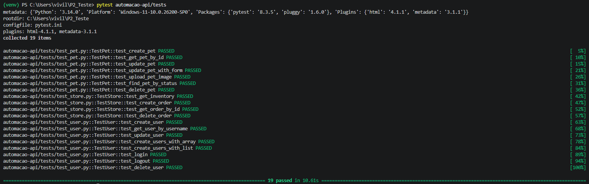
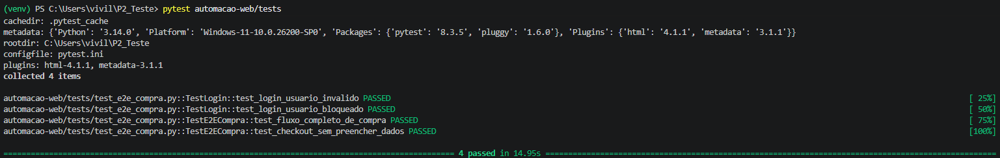
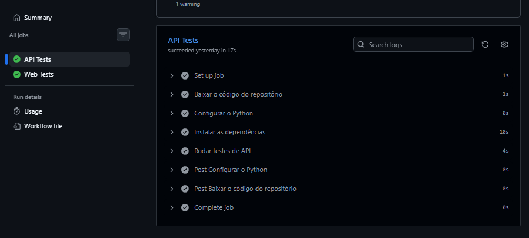
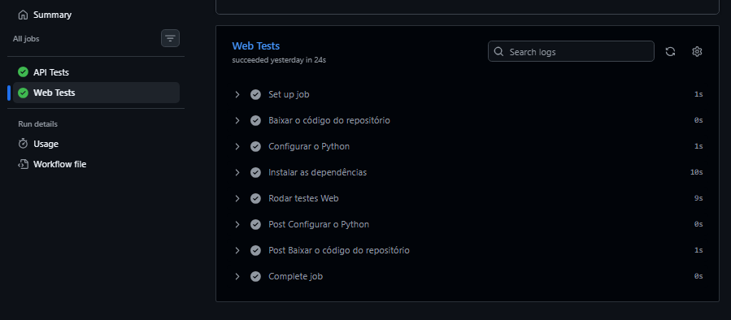

# Projeto de Automação de Testes — API e Web

Projeto de automação de testes em Python com dois módulos independentes: testes de API REST e testes Web E2E, utilizando o padrão Page Objects.

---

## Tecnologias Utilizadas

| Tecnologia | Versão | Uso |
|---|---|---|
| Python | 3.12 | Linguagem base |
| Pytest | 8.3.5 | Framework de testes |
| Requests | 2.32.3 | Requisições HTTP (testes de API) |
| Selenium | latest | Automação de browser (testes Web) |
| pytest-html | 4.1.1 | Geração de relatórios HTML |
| GitHub Actions | — | CI/CD |

---

## Estrutura do Projeto

```
├── automacao-api/
│   ├── base/          
│   ├── payloads/      
│   └── tests/
│       ├── test_pet.py
│       ├── test_store.py
│       └── test_user.py
├── automacao-web/
│   ├── pages/         
│   │   ├── login_page.py
│   │   ├── inventory_page.py
│   │   ├── cart_page.py
│   │   └── checkout_page.py
│   ├── utils/
│   │   └── driver.py 
│   └── tests/
│       └── test_e2e_compra.py
├── .github/workflows/
│   └── ci.yml
└── requirements.txt
```

---

## Instalação

**Pré-requisitos:** Python 3.12+ e Google Chrome instalados.

```bash
# 1. Clone o repositório
git clone https://github.com/marcusviniciusend/automacao-web-api-python.git
cd automacao-web-api-python

# 2. Crie e ative o ambiente virtual
python -m venv venv

# Windows
venv\Scripts\activate

# Linux/Mac
source venv/bin/activate

# 3. Instale as dependências
pip install -r requirements.txt
```

---

## Execução

### Todos os testes
```bash
pytest
```

### Apenas testes de API
```bash
pytest automacao-api/tests
```

### Apenas testes Web
```bash
pytest automacao-web/tests
```

### Com relatório HTML
```bash
pytest --html=report.html
```

---

## Cobertura dos Testes e Prints do Terminal

### API — Swagger Petstore (`https://petstore.swagger.io`)

| Módulo | Testes |
|---|---|
| Pet | Criar, buscar por ID, atualizar, atualizar por form, upload de imagem, buscar por status, deletar |
| Store | Buscar inventário, criar pedido, buscar pedido por ID, deletar pedido |
| User | Criar, buscar por username, atualizar, criar via array, criar via lista, login, logout, deletar |



### Web — SauceDemo (`https://www.saucedemo.com`)

| Teste | Descrição |
|---|---|
| `test_fluxo_completo_de_compra` | Login → adicionar produto → carrinho → checkout → confirmação do pedido |
| `test_login_usuario_invalido` | Verifica mensagem de erro ao logar com credenciais inválidas |
| `test_login_usuario_bloqueado` | Verifica mensagem de erro ao logar com usuário bloqueado (`locked_out_user`) |
| `test_checkout_sem_preencher_dados` | Verifica que o formulário de checkout bloqueia a navegação com campos vazios |



---

## Pipeline CI/CD e Prints do GitHub Actions

O projeto utiliza GitHub Actions com dois jobs paralelos:

- **API Tests** — executa os testes de API



- **Web Tests** — executa os testes E2E com Chrome headless




---

